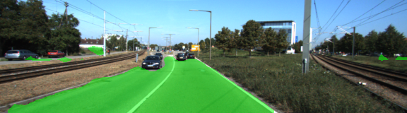
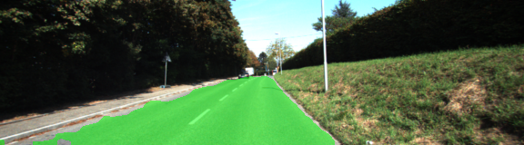
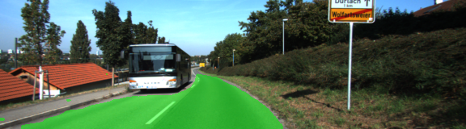
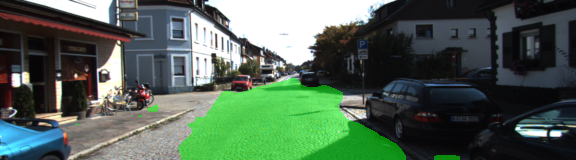
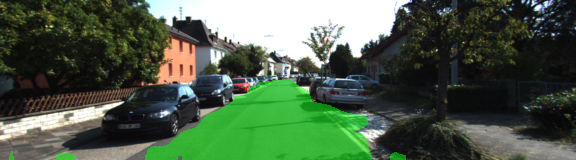
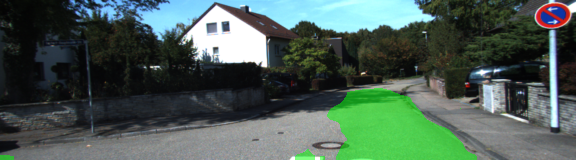
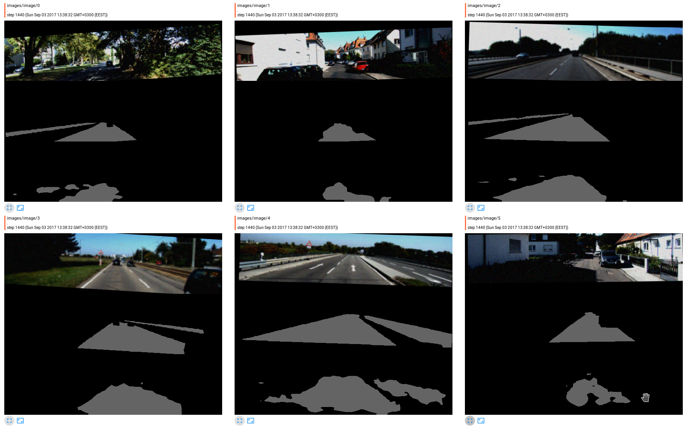
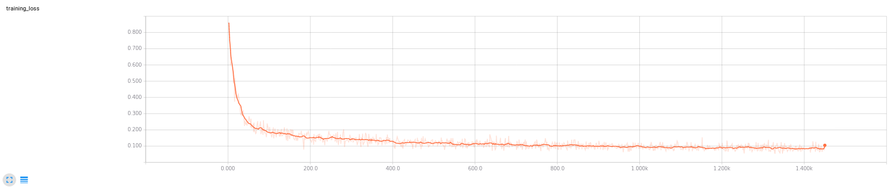
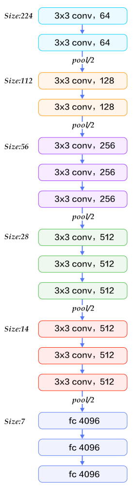

# Semantic Segmentation

Project is about labeling the pixels of a road in images using a Fully Convolutional Network (FCN). Project is done in Python 3.6, DNN framework TensorFlow and monitoring/debuging done by Tensorboard and Visual Studio Code.

# Results

### Testing results using [helper.py](helper.py) project testing function

You can see that there are some really good results and some not that good. There (of-course) are much more job to do to improve results but I would start with larger dataset.








### Images and label masks feeded into neural NN, plotted in Tensorboard. In each window there are three images

1. Augmented input image
2. Label mask
3. NN output



### Training loss during one of the training sessions, plotted in Tensorboard



# Project rquirements

Make sure you are using [Python 3.x](https://www.python.org/)

Install Python dependecies using [requirements.txt](requirements.txt). If you are using Tensorflow compiled from sources then remove tensorflow line from requirements.

```pip install --upgrade -r requirements.txt```

Or install Python dependecies manually:

 - [TensorFlow](https://www.tensorflow.org/)
 - [NumPy](http://www.numpy.org/)
 - [SciPy](https://www.scipy.org/)
 - [TQDM](https://pypi.python.org/pypi/tqdm)
 - [Protobuf](https://github.com/google/protobuf/tree/master/python)
 - Optional! [Tensorboard](https://www.tensorflow.org/get_started/summaries_and_tensorboard)

### Dataset

Download the [Kitti Road dataset](http://www.cvlibs.net/datasets/kitti/eval_road.php) from [here](http://www.cvlibs.net/download.php?file=data_road.zip).  Extract the dataset in the `data` folder.  This will create the folder `data_road` with all the training a test images.

# Running project

Run `python main.py --help` to see project options. Output should look like this:

```
usage: main.py [-h] [--image_shape IMAGE_SHAPE [IMAGE_SHAPE ...]]
               [--num_classes NUM_CLASSES] [--epochs EPOCHS]
               [--batch_size BATCH_SIZE] [--learning_rate LEARNING_RATE]
               [--data_dir DATA_DIR] [--runs_dir RUNS_DIR]
               [--test_name TEST_NAME] [--chk_path CHK_PATH]
               [--pb_path PB_PATH] [--mode MODE]

optional arguments:
  -h, --help            show this help message and exit
  --image_shape IMAGE_SHAPE [IMAGE_SHAPE ...]
                        Resized image shape which will be used as input for
                        neural net.
  --num_classes NUM_CLASSES
                        Number of classes.
  --epochs EPOCHS       Number of epochs.
  --batch_size BATCH_SIZE
                        Number of batches.
  --learning_rate LEARNING_RATE
                        Optimizer initial learning rate.
  --data_dir DATA_DIR   Data directory path.
  --runs_dir RUNS_DIR   Runs directory path.
  --test_name TEST_NAME
                        Test name, used when create log dir with summaries as
                        prefix
  --chk_path CHK_PATH   Re-save checkpoint path for optimization. If not set
                        then won't save anything.
  --pb_path PB_PATH     Path to optimized FCN model for inferece.
  --mode MODE           Run code in possible modes:
                        --mode train : Will train and save mode. Afterwards test and save results.
                        --mode inference_model : Will re-save checkpoint path for optimization. For this --chk_path must be provided
                        --mode inference_test : Will run inference model on test video. --pb_path must be provided
                        --mode project_test : Will only perform project unit tests.
```

Descriptions should be clear enough to start working with code however I recommend to first run [main.py](main.py) in test mode, it will only perform tests and if necesarry download some stuff:

```
python main.py --mode project_test
```

## Training

### Run

To train FCN using custom parameters run:

```
python main.py --mode train --test_name MyFirstTest --learning_rate 1e-6 --batch_size 10 --epochs 25 --num_classes 2 --image_shape 160 576 3
```

Note that `--image_shape` is not original image shape but shape you want the original to be resized before feeding it to NN.

Once training is completed FCN model will be saved in `./data/vgg_fcn/` directory and script will run [helper.py](helper.py) `gen_test_output` testing and results will be saved in `./runs` directory.

### Monitoring

While training terminal will output loss and some other useful information be may want ot get more insights of what's going in. For this I've created Tensorflow summaries and they are updating while model is being trained.

Run tensorboard from any directory by providing full path to logdir (created by [main.py](main.py)):

```
tensorboard --logdir=/full/path/to/logdir/
```

Tensorboard then will tell you link which needs to be open in browser. That's it, you can now check how loss is changing over time or images that are feed into NN and more (just add more summaries).

_Note that summaries will be flushed to logdir every 60 seconds and you may need to wait a little bit for loss and images to appear in tensorboard._ 

## Optimization

Before optimization we must create pbtxt model description. Run:

```
python main.py --mode inference_model --chk_path path-to-chk
```

Once it is done we can optimize trained model for inference. Edit all paths in [optimization script](optimize_for_inference.sh) and run `bash optimize_for_inference.sh`. This script will create new models in protobuf (pb) format.

__NB!:__ Currently .pbtxt file will be created very huge because we are using `tf.saved_model.loader.load` and all variables there are constants. Model.pbtxt contains model description as well as constants. Because of this I wasn't able to run optimization because of memory error (consumed all 64GB of RAM).

__TODO:__ Restore model with TF code and all weigths as variables not constants.

## Run Inference on Video

__TODO:__ Run inference model on video and monitor time and visual results.

```
python main.py --mode inference_test --pb_path path-to-opmized-protobuf-model
```

# Description

VGG16 in numbers           |  VGG16 FCN8s
:-------------------------:|:-------------------------:
  |  